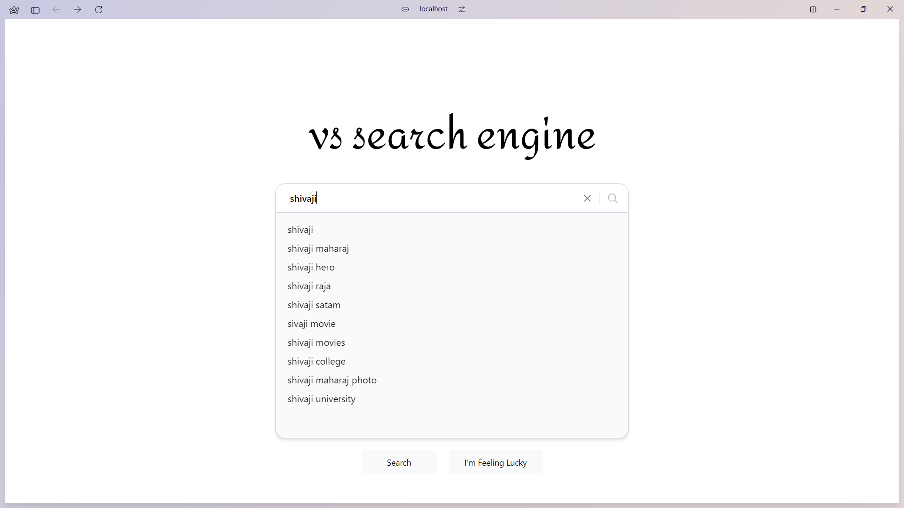
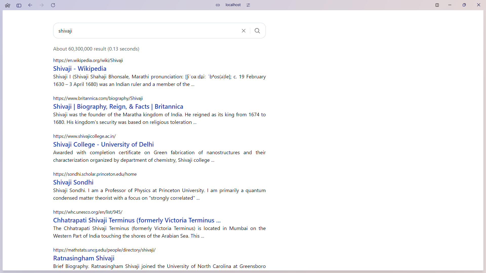

# Project Title

I created a small website that incorporates advanced concepts like debouncing, caching, API aborting, and pagination. Through this project, I gained valuable experience in designing efficient and user-friendly web applications that optimize performance and data management.

## Features

- Debouncing: Reduces unnecessary API requests by waiting for a short pause in user input before sending a request.

- Caching: Stores data locally after the first request, so the app doesn’t need to fetch the same data repeatedly, speeding up performance.

- API Call Abortion: Cancels any ongoing API request when a new one is made, preventing old or unnecessary data from being processed.

- Pagination: Breaks down large sets of data into smaller chunks, making it easier to load and view without slowing down the app.

These features work together to make the app smoother, faster, and more responsive for users.

## Tech Stack

Typescript, React.js, Next.js, TailwindCSS

## Screenshots




## Run Locally

Clone the project

```bash
  git clone https://github.com/ShivajiKS/mimic_google_search_features.git
```

Go to the project directory

```bash
  cd mimic_google_search_features
```

Install dependencies

```bash
  pnpm install
```

Start the server

```bash
  pnpm run dev
```
